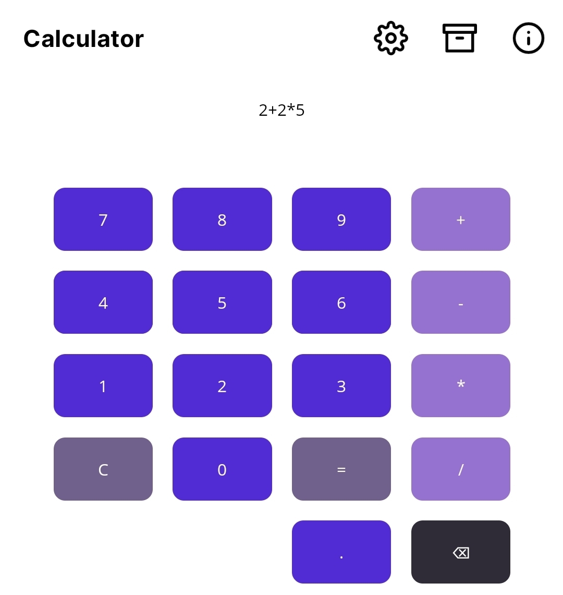
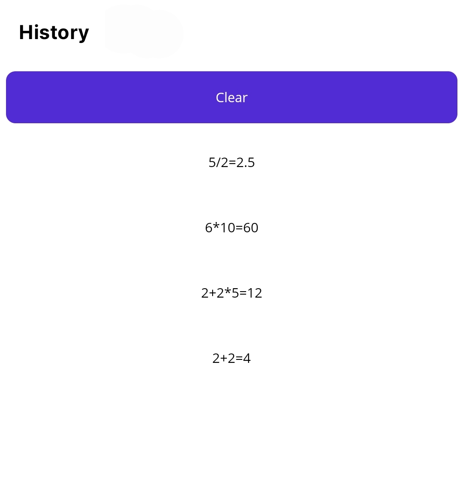
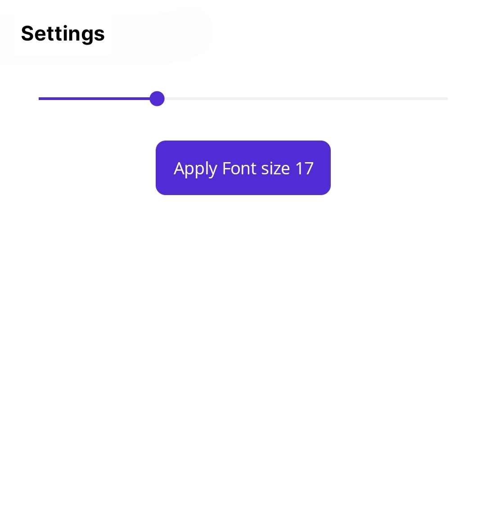

# MauiCalc

MauiCalc is a rather simple calculator app built in [Microsoft's .NET MAUI](https://dotnet.microsoft.com/en-us/apps/maui). The app is designed to perform basic arithmetic operations and store these in a [SQLite](https://www.sqlite.org/index.html) based history. 

## Features

- Basic arithmetic operations such as addition, subtraction, multiplication, and division
- History of calculations stored in SQLite database
- Settings tab

|  |  |  |
| :------------------- | :----------: | ----------: |

## Installation

1. Clone the repository to your local machine.
2. Open the solution file in Visual Studio.
3. Build and run the project.

## Requirements
- A Windows Computer
- Visual Studio 2022
- At least 2 braincells

## Usage

1. Get a brain
2. Launch the app

## Contributing

Contributions are welcome! If you find any bugs or have suggestions for new features, please open an issue or submit a pull request. (will not read)

Icons used in this project are from [feathericons](https://feathericons.com/).

